# ACCESS.LOG AND ZAP FEATURE

1. Intelligence gathering 
- Spider: Spider là một công cụ được sử dụng để tự động khám phá các tài nguyên mới (URL) trên một Site cụ thể. Nó bắt đầu bằng một danh sách các URL cần truy cập, được gọi là các hạt giống, tùy thuộc vào cách Spider được khởi động. Sau đó, Spider sẽ truy cập các URL này, xác định tất cả các siêu liên kết trong trang và thêm chúng vào danh sách các URL cần truy cập và quá trình này tiếp tục theo cách đệ quy miễn là tìm thấy các tài nguyên mới.
    + Log: 
        + IP: cùng 1 địa chỉ IP 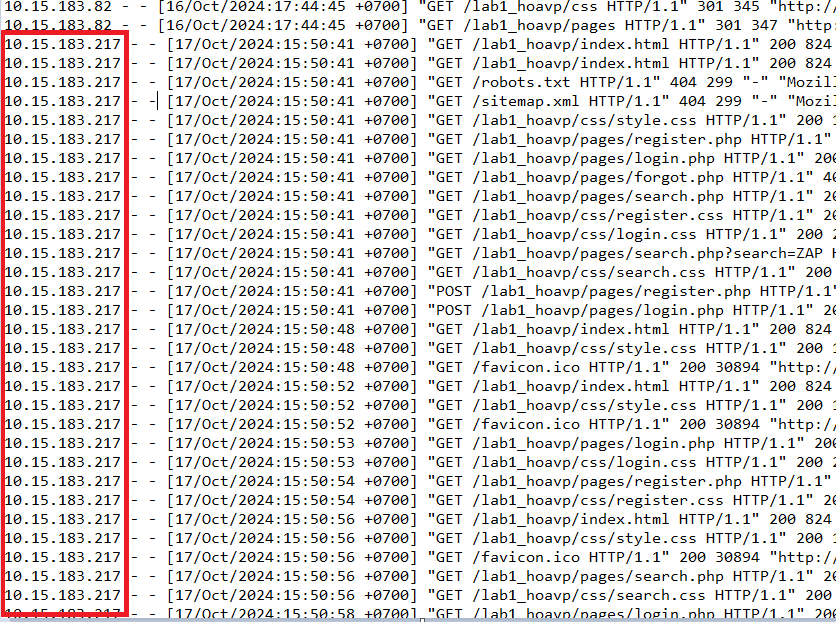
        + Timestamp: trong cùng 1 khoảng tgian 15:50
        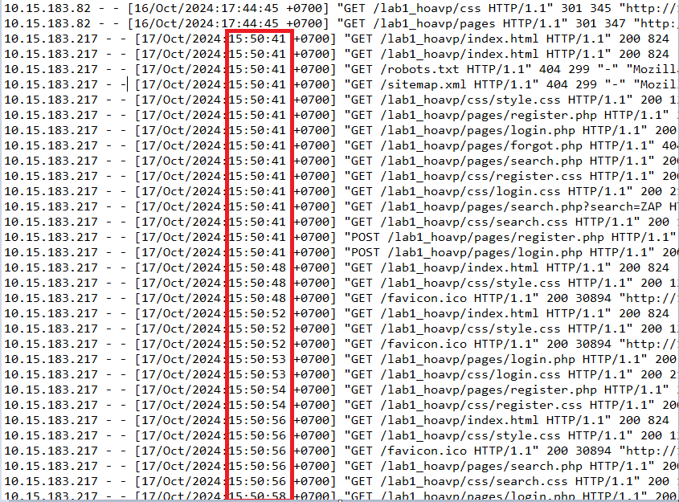
        + Agent: cùng agent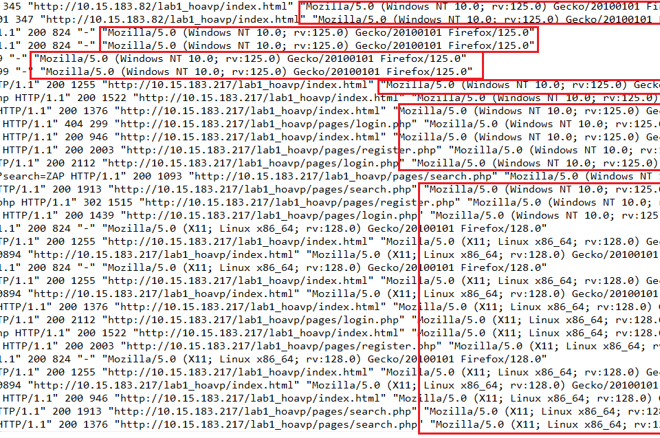
        + Request line: Method chủ yếu là GET, POST xuất hiện ở 1 số site có form điền (login.php; register.php). Các trang index.html, login.php, register.php, search.php đều đã truy cập nhiều lần. Yêu cầu tải các trang như login.css, register.css, search.css đều trả về status code là 200 (thành công).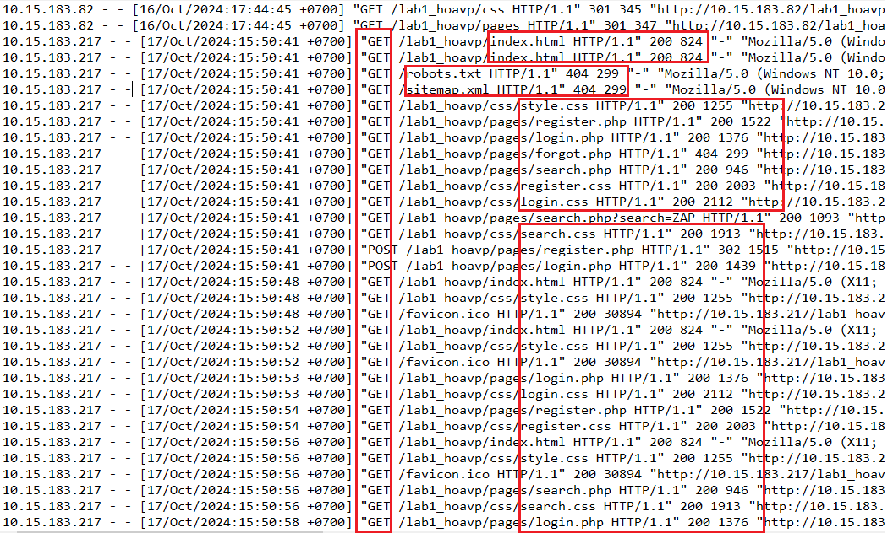
    -  Nhận định: nhận thấy trong một khoảng thời gian rất ngắn ( cùng là 15:50 chỉ chênh lệnh từng giây), cùng 1 địa chỉ IP, cùng 1 AGENT, xuất hiện rất nhiều các request GET, POST tới các site của web. Việc thực hiện lặp đi lặp lại như vậy tới các site của trang web cho thấy có khả năng 1 công cụ nào đó đang quét tới web site để thu thập thông tin. 

    
- Passive Scan: ZAP quét thụ động tất cả các HTTP messages (requests và responses) được gửi đến web app đang được test. Passive scan không thay đổi các request cũng như responses theo bất kỳ cách nào và do đó an toàn khi sử dụng. Quét được thực hiện trong một luồng nền để đảm bảo rằng nó không làm chậm quá trình khám phá ứng dụng.

    + Log: Passive scan đóng vai trò như 1 proxy, nó  theo dõi và thu thập toàn bộ traffic đi qua proxy, nó không tạo thêm request mới và khi nhận response về thì nó sẽ thực hiện phân tích. Log của nó có trong ZAP log. 
    + =>> Nói chung passive scan thực hiện phân tích respone là chính. 

- web socket: WebSockets có thể được các ứng dụng web hoặc trang web sử dụng để thiết lập kênh giao tiếp bi-directional (two-way), gia tiếp full duplex thông qua một kết nối TCP duy nhất. Nó có giao thức nhẹ, cho phép các nhà phát triển nhận ra các trường hợp sử dụng theo thời gian thực. WebSockets cũng cung cấp một giải pháp thay thế cho việc sử dụng nhiều Ajax, HTTP Long Polling hoặc Comet. Sau khi bắt tay dựa trên HTTP ban đầu, kết nối TCP được giữ mở, cho phép các ứng dụng gửi và nhận dữ liệu tùy ý. Thường sử dụng cổng 80 hoặc 443 cho các kênh WebSocket được mã hóa.
    + Đại khái là con này sẽ thực hiện send request handshake tới server, nếu mà server ok thì kết nối web socket được thiết lập và từ đó cả 2 trao đổi dữ liệu liên tục. Trong phần request handshake tới server thì có yêu cầu "upgrade", hoặc Sec-WebSocket-Key, Sec-WebSocket-Version là đặc trưng của web socket, mã phản hồi 101 Switching Protocols cũng là 1 trong các đặc trưng
    +  Con ZAP thì chặn, theo dõi và phân tích các messages và nó cũng k gửi thêm request 
    + =>> chưa có thông tin trong access.log, nguyên nhân là do chưa thực nghiệm web socket thành công

- Forced browsing: Forced Browsing là một kỹ thuật tấn công mà kẻ tấn công cố gắng truy cập các tài nguyên trên một ứng dụng web mà không được phép. Kỹ thuật này thường được sử dụng để phát hiện các trang hoặc file không được liên kết từ giao diện người dùng nhưng có thể tồn tại trên máy chủ. 
    + Code : 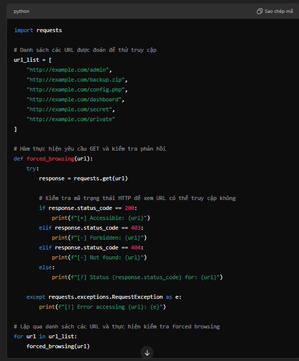
    + Log: 
        + IP : cùng 1 IP
        + TIMESTAMP: cùng 1 khoảng tgian 14:34:54 
        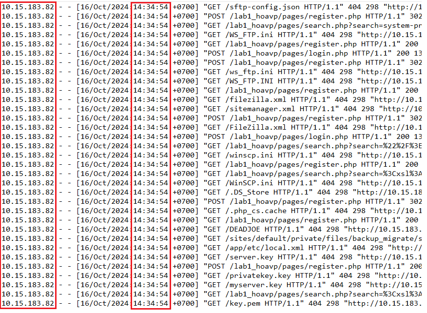
        + Request line: Method chính là GET và POST, các request cố gắng truy cập các tài nguyên đặc biệt, status code trả về là 403, 404, 301,200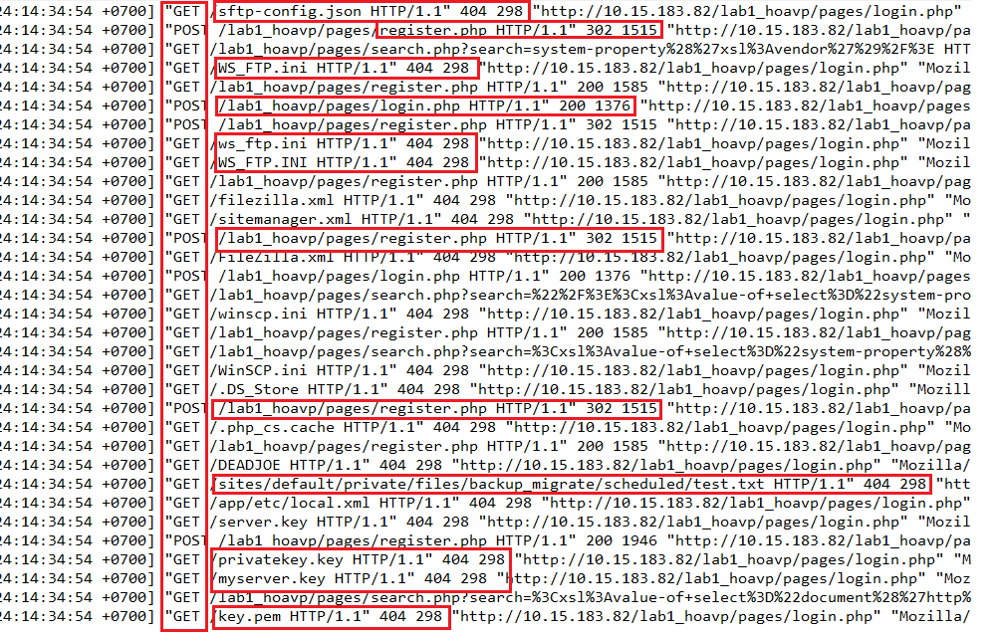
        + AGENT: cùng AGENT
    + Nhận định: Trong cùng 1 khoảng thời gian,cùng 1 địa chỉ IP gửi rất nhiều các request tới server yêu cầu các tài nguyên đặc biệt.Vậy đây có thể là sự dò quét từ công cụ nào đó tới trang web để xác định tài nguyên có tồn tại không 

2. Scanning
- Automated Scan: gồm 2 cơ chế quét là Spider và Ajax Spider
    + Điểm khác biệt của 2 cơ chế này: AJAX Spider thực hiện mô phỏng hành vi duyệt web của người dùng như tự động nhấn các nút, tải trang,... Nó có khả năng phát hiện các URL mà Spider thường bỏ xót. Nói chung là Spider thì thu thập liên kết từ HTML tĩnh còn AJAX Spider thu thập liên kết cả các thực thi JavaScript.
- AJAX Spider: 
    + Log; 
        + IP: cùng 1 địa chỉ IP là 10.15.183.82
        + TIMESTAMP: Trong khoảng thời gian ngắn ( 17:43:...)
        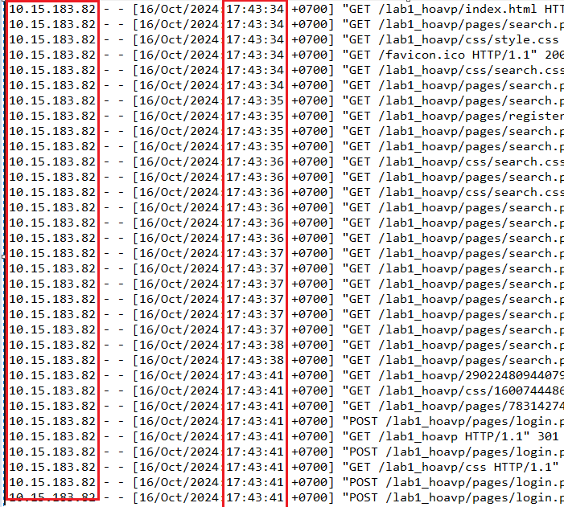
        + Request line: Method chủ yếu là GET và POST, uri chỉ đến search.php khá nhiều và có trường đầu vào. Một số request POST ở các trang như login.php hoặc register.php.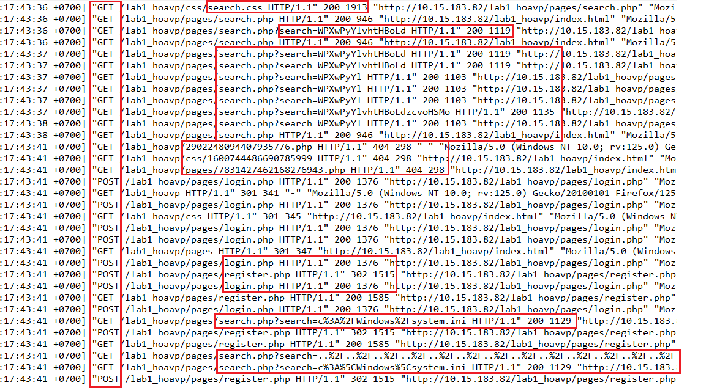
        + AGENT: cùng AGENT
        + Status code: chủ yếu là 200, xuất hiện code =404 với các tài nguyên k tìm thấy và code =302 với các trang như login.php và register.php
    + Nhận định: Trong 1 khoảng thời gian ngắn, với cùng 1 địa chỉ IP,cùng Agent, xuất hiện rất nhiều request tới server với method là GET và POST yêu cầu các tài nguyên sau khi thực thi. Kết quả trả về thường là 200 đối với trang như search.php. Các trường đầu vào tại search.php là các chuỗi lạ? . Mục đích của các request này có thể là xác nhận sự tồn tại của tài nguyên, hoặc dò quét tìm kiếm thêm các liên kết sau khi server thực thi các request.

- Active Scanning: gửi các yêu cầu có chủ đích để kiểm tra khả năng bảo mật của ứng dụng, như tấn công SQL Injection hoặc XSS.
    + Log: 
    
        + IP :cùng 1 IP
        + TIMESTAMP: cùng 1 tgian
        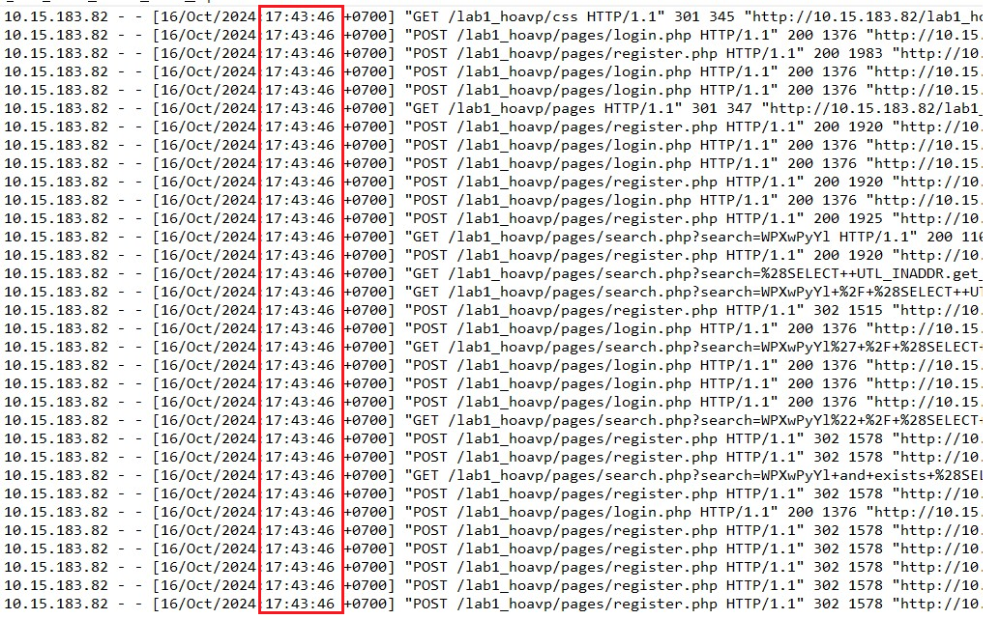
        + Method HTTP: POST đối với login.php, register.php. GET đối với search.php
        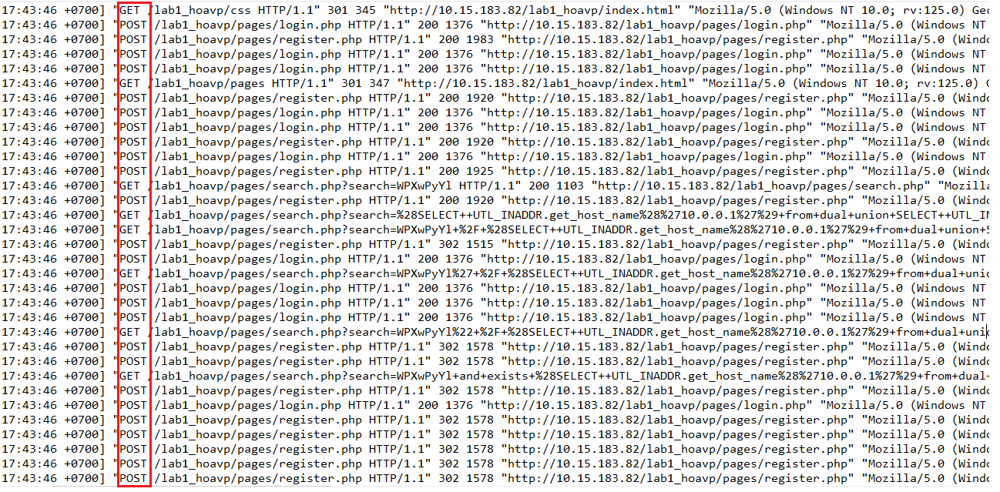
        + URI: với method GET trên trang search.php, xuất hiện các trường dữ liệu liên quan tới truy vấn SQL (GET /lab1_hoavp/pages/search.php?search=vdcYrBgP+%2F+%28SELECT++UTL_INADDR.get_host_name%28%2710.0.0.1%27%29+from+dual+union+SELECT++UTL_INADDR.get_host_name%28%2710.0.0.2%27%29+from+dual+union+SELECT++UTL_INADDR.get_host_name%28%2710.0.0.3%27%29+from+dual+union+SELECT++UTL_INADDR.get_host_name%28%2710.0.0.4%27%29+from+dual+union+SELECT++UTL_INADDR.get_host_name%28%2710.0.0.5%27%29+from+dual%29+), đáng chú ý là payload UTL_INADDR.get_host_name, có vẻ như đây là 1 cuộc tấn công SQL injection
        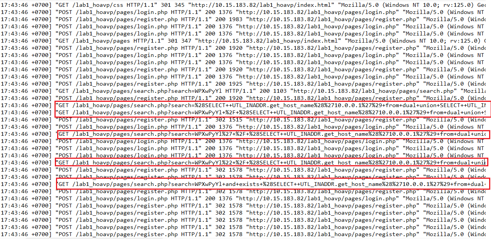
        + AGENT: cùng Agent
        + Status code: chủ yếu là 200, có 302 đối với trang register.php
    + Nhận định: Trong cùng 1 thời điểm, cùng 1 địa chỉ IP, cùng Agent, xuất nhiều nhiều request với phương thức là GET và POST tới server, đáng chú với các request POST tới search.php xuất hiện các yêu cầu gồm payload SQL Injection. 