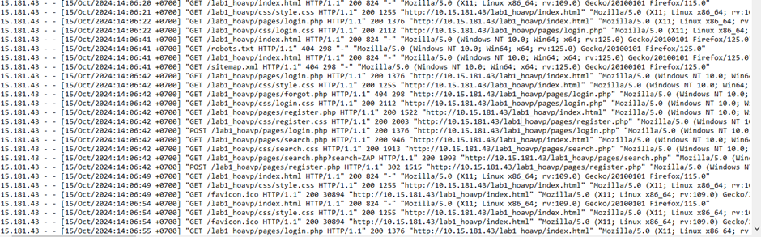
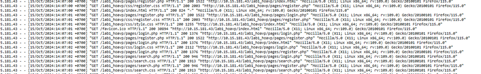
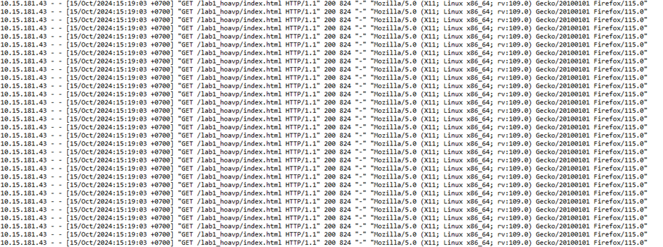
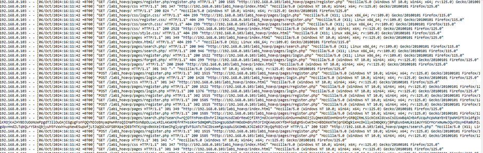
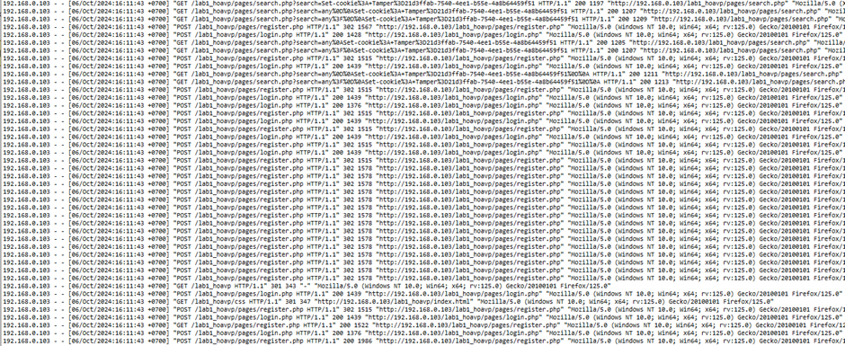
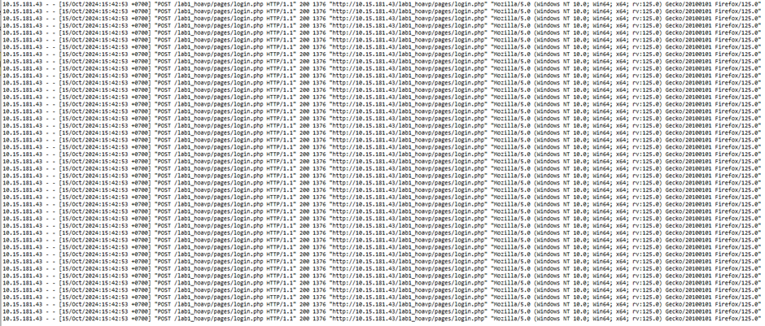

# ACCESS.LOG AND ZAP FEATURE

1. Intelligence gathering 
- Spider: The Spider is a tool that is used to automatically discover new resources (URLs) on a particular Site. It begins with a list of URLs to visit, called the seeds, which depends on how the Spider is started. The Spider then visits these URLs, it identifies all the hyperlinks in the page and adds them to the list of URLs to visit and the process continues recursively as long as new resources are found.
    + Log: 
    + explain: spider starts with the root node to collect relevant page links, and uploads sitemap.xml and robots.txt files to collect information about the links

- Passive Scan: ZAP by default passively scans all HTTP messages (requests and responses) sent to the web application being tested. Passive scanning does not change the requests nor the responses in any way and is therefore safe to use. Scanning is performed in a background thread to ensure that it does not slow down the exploration of an application.

    + Log: 
    + Explain : Passive scanning does not change the state of the application so all default HTTP messages can be collected in passive scanning

- web socket: WebSockets can be used by web applications or web sites to setup a bi-directional (two-way), full duplex communication channel over a single TCP connection. It features a lightweight protocol, allowing developers to realize realtime use cases. WebSockets do also provide an alternative to heavy use of Ajax, HTTP Long Polling or Comet.  After an initial HTTP based handshake, the TCP connection is kept open, allowing applications to send & receive arbitrary data. Often port 80 or 443 for encrypted WebSocket channels are used.
    + Log : no information

- forced browsing: ZAP allows you to try to discover directories and files using forced browsing. A set of files are provided which contain a large number of file and directory names. ZAP attempts to directly access all of the files and directories listed in the selected file directly rather than relying on finding links to them.
    + Log: 
    + Explain: forced browsing attempts to directly access all of the files and directories listed in the selected file directly rather than relying on finding links to them. 

2. Scanning 

- Automated Scan: include spider and ajax spider
    + ajax spider: The AJAX Spider add-on integrates in ZAP a crawler of AJAX rich sites called Crawljax. You can use it to identify the pages of the targeted site. You can combine it with the (normal) spider for better results
    

- active scan: Active scanning attempts to find potential vulnerabilities by using known attacks against the selected targets.
    + Log: 

- vulnerability analysis: UI/UX in ZAP

3. Threat modeling 
- include "Alert System" and "Contex Management" 

4. Vulnerability analysis
 - include vulnerability analysis (UI/UX in ZAP) and fuzzer
 - fuzzer: Fuzzing is a technique of submitting lots of data to a target (often in the form of invalid or unexpected inputs).
ZAP allows you to fuzz any request using:A built-in set of payloads;Payloads defined by optional add-ons;Custom scripts
    + Log: 

5. Exploitation 
-  Scripting :  ZAP supports scripts that can be embedded within ZAP and can access internal ZAP data structures and classes. These scripts allow you to dynamically enhance ZAP from within ZAP.
    + Log: no infor