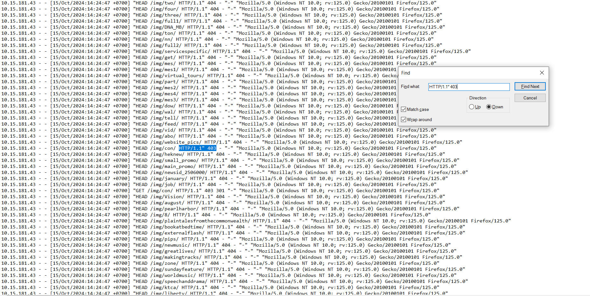

# ACCESS.LOG AND ZAP FEATURE

1. Intelligence gathering 
- Spider: Spider là một công cụ được sử dụng để tự động khám phá các tài nguyên mới (URL) trên một Site cụ thể. Nó bắt đầu bằng một danh sách các URL cần truy cập, được gọi là các hạt giống, tùy thuộc vào cách Spider được khởi động. Sau đó, Spider sẽ truy cập các URL này, xác định tất cả các siêu liên kết trong trang và thêm chúng vào danh sách các URL cần truy cập và quá trình này tiếp tục theo cách đệ quy miễn là tìm thấy các tài nguyên mới.
    + Log: 
    + Đầu tiên xuất hiện sitemap.xml + robots.txt, tiếp theo là trong 1 khoảng thời gian ngắn xuất hiện rất nhiều giao thức GET, đây là đặc trưng của spider khi nó send request GET liên tục, nếu xuất hiện POST thì có nghĩa là site đó có form (vd: login.php/register.php)

    + Nhận thấy các request được gửi liên tục đến các site khác nhau, nhưng thường là sau vài request thì sẽ lại chuyển về gửi request đến site cũ.
- Passive Scan: ZAP quét thụ động tất cả các HTTP messages (requests và responses) được gửi đến web app đang được test. Passive scan không thay đổi các request cũng như responses theo bất kỳ cách nào và do đó an toàn khi sử dụng. Quét được thực hiện trong một luồng nền để đảm bảo rằng nó không làm chậm quá trình khám phá ứng dụng.

    + Log: Passive scan đóng vai trò như 1 proxy, nó  theo dõi và thu thập toàn bộ traffic đi qua proxy, nó không tạo thêm request mới và khi nhận response về thì nó sẽ thực hiện phân tích. Log của nó có trong ZAP log. 
    + =>> Nói chung passive scan thực hiện phân tích respone là chính. 

- web socket: WebSockets có thể được các ứng dụng web hoặc trang web sử dụng để thiết lập kênh giao tiếp bi-directional (two-way), gia tiếp full duplex thông qua một kết nối TCP duy nhất. Nó có giao thức nhẹ, cho phép các nhà phát triển nhận ra các trường hợp sử dụng theo thời gian thực. WebSockets cũng cung cấp một giải pháp thay thế cho việc sử dụng nhiều Ajax, HTTP Long Polling hoặc Comet. Sau khi bắt tay dựa trên HTTP ban đầu, kết nối TCP được giữ mở, cho phép các ứng dụng gửi và nhận dữ liệu tùy ý. Thường sử dụng cổng 80 hoặc 443 cho các kênh WebSocket được mã hóa.
    + Đại khái là con này sẽ thực hiện send request handshake tới server, nếu mà server ok thì kết nối web socket được thiết lập và từ đó cả 2 trao đổi dữ liệu liên tục. Trong phần request handshake tới server thì có yêu cầu "upgrade", hoặc Sec-WebSocket-Key, Sec-WebSocket-Version là đặc trưng của web socket, mã phản hồi 101 Switching Protocols cũng là 1 trong các đặc trưng
    +  Con ZAP thì chặn, theo dõi và phân tích các messages và nó cũng k gửi thêm request 
    + =>> chưa có thông tin trong access.log, nguyên nhân là do chưa thực nghiệm web socket thành công

- Forced browsing: Forced Browsing là một kỹ thuật tấn công mà kẻ tấn công cố gắng truy cập các tài nguyên trên một ứng dụng web mà không được phép. Kỹ thuật này thường được sử dụng để phát hiện các trang hoặc file không được liên kết từ giao diện người dùng nhưng có thể tồn tại trên máy chủ. 
    + Log: 
    
    + Con ZAP sẽ có 1 list tài nguyên được tạo sẵn hoặc là được tạo dựa trên cấu trúc của web app mà nó quét được. Nó dùng cái list đấy gửi các request đến các site mà nó cho là có tồn tại, các giao thức thường xuất hiện trong request có thể là GET, POST, HEAD, PUT. Sau đó nó dựa vào mã trạng thái trong responses để nó phân tích xem là site đó có tồn tại không, thường mã trạng thái trả về là 200 (ok), 404 (forbidden) hoặc 404 (not found).

