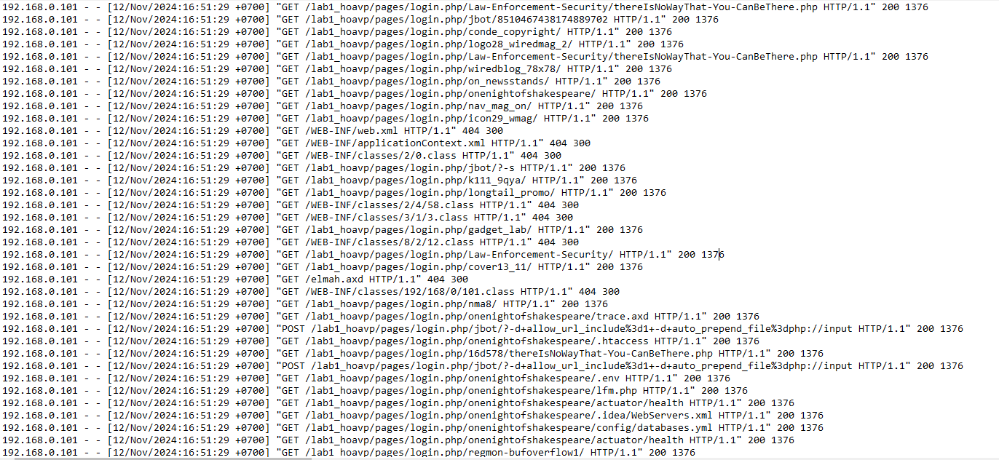
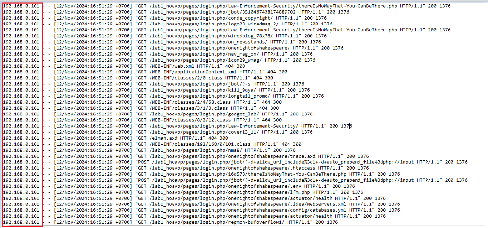
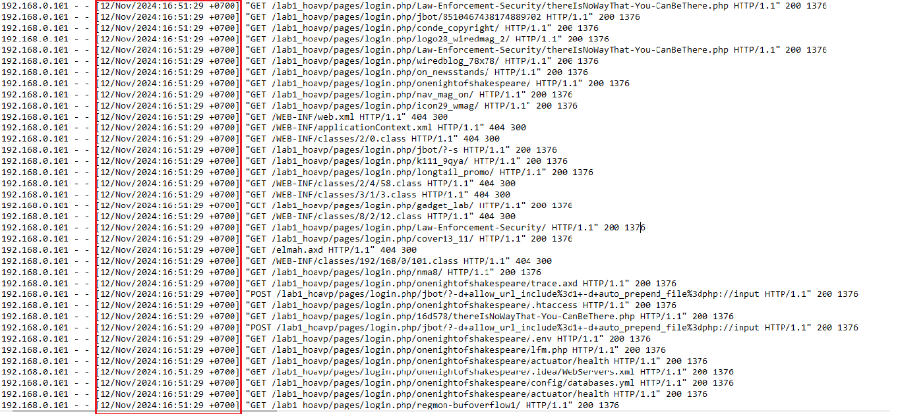
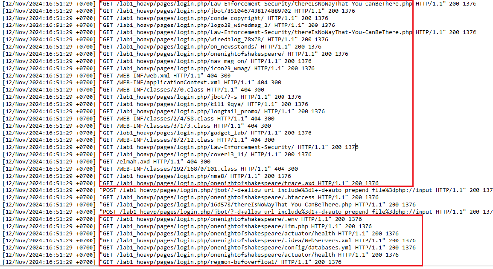
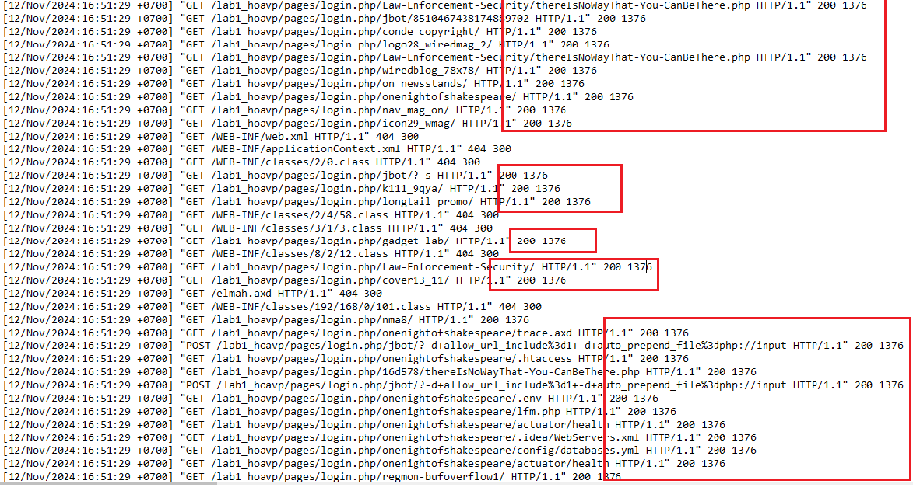
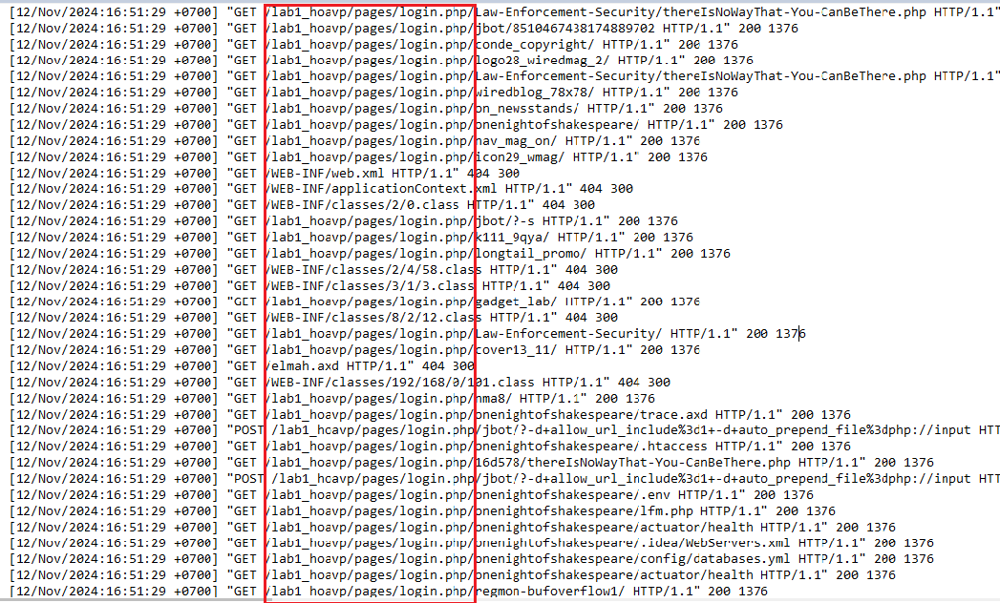
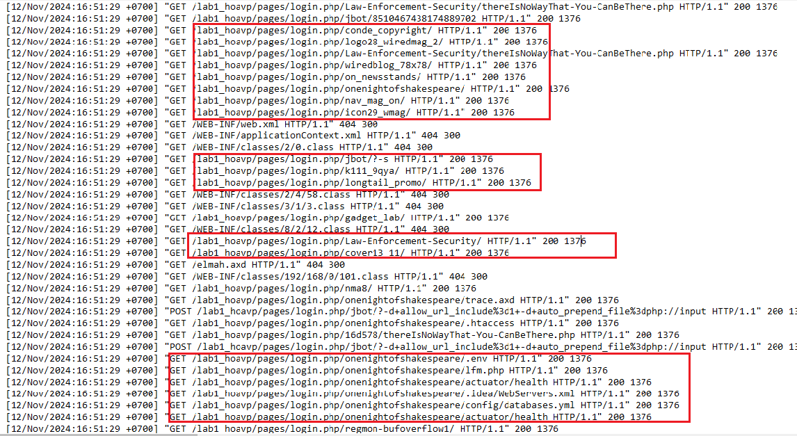
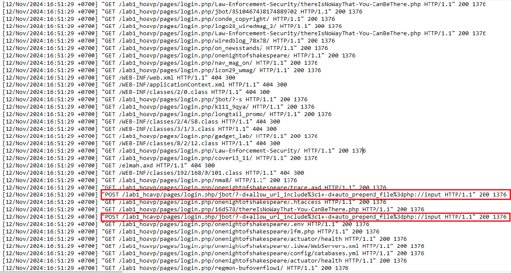
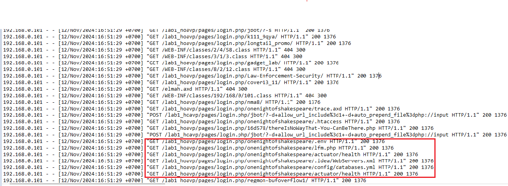

# Fuzzing

Fuzzing (hay fuzz test) là một kiểm thử bảo mật được sử dụng để phát hiện lỗi và lỗ hổng trong phần mềm, ứng dụng web, hoặc hệ thống bằng cách đưa vào các dữ liệu ngẫu nhiên, không mong đợi hoặc không hợp lệ. Mục tiêu là xem hệ thống phản hồi thế nào khi gặp các dữ liệu đầu vào bất thường.

# Cơ chế fuzzing

Fuzzing hoạt động dựa trên việc tạo ra và gửi các dữ liệu đầu vào bất thường đến các điểm đầu vào của ứng dụng (form, ...).  Cơ chế của nó gồm:
1. Xác định mục tiêu kiểm thử
    - Lựa chọn ứng dụng, module hoặc thành phần cụ thể cần được fuzzing
    - Xác định các điểm đầu ( form nhập liệu, header HTTP, API endpoint)
2. Tạo dữ liệu đầu vào ngẫu nhiên hoặc có cấu trúc
    - Dữ liệu ngẫu nhiên : chuỗi ký tự, số, ký tự đặc biệt được tạo ngẫu nhiên
    - Dữ liệu có cấu trúc: Dựa trên mẫu cố định (JSON, XML) có các giá trị không hợp lệ

3. Gửi dữ liệu đến hệ thống
    - Fuzz gửi đến hệ thống thông qua HTTP request,...
4. Giám sát và phản hồi
    - Theo dõi xem hệ thống có phản hồi bất thường không ( crash, freeze, leak memory) hoặc các phản hồi lỗi bảo mật (XSS, SQLi)
    - Ghi lại các phản hồi và tìm kiếm các dấu hiệu cho thấy lỗ hổng tồn tại trong ứng dụng
5. Phân loại fuzzing
    - Black box
    - White box
    - Grey box

# Dấu hiệu nhận biết thông qua Log 
- Trong các file log (access, error), xuất hiện các request chứa chuỗi ký tự lạ, dài hoặc các ký tự đặc biệt không hợp lệ

# Check Log

 - IP: cùng địa chỉ 
 - Timestamp : trong 1s ( 16:51:29) 
 - Request line: Chủ yếu là phương thức "GET", 2 dòng chứa phương thức " POST". Các request tập trung hết vào trang login và đang cố gắng truy cập vào những tài nguyên "lạ" 
 
 - Status code : Chủ yếu response code là 200, một số là 404. Với những request có response code là 200 thì response size đều trả về là 1376, chứng tỏ cùng cho ra một phản hồi. 
  
 - Agent: không có ?

 - Nhận định:
    - Các request dều xuất phát từ 1 URI gốc(login.php) 
    - Các request dẫn đến tài nguyên lạ 
    
    Điều này thể hiện xuất hiện nỗ lực thăm dò vào các file cấu hình nhạy cảm. Các file như ".env", ".htaccess," web.xml", "applicationContext.xml" thường chứa thông tin cấu hình quan trọng và không nên được truy cập trực tiếp từ bên ngoài. Việc cố gắng truy cập chúng là dấu hiệu rõ ràng của một cuộc tấn công.
    - Request "POST" bất thường 
    
    Trong request xuất hiện 1 số các ký tự đặc biệt, có thể đây là dấu hiệu của 1 tấn công nào đó
    - Tìm kiếm các endpoint phổ biến trong Java hoặc ứng dụng Spring Boot 
    - 
 
 * Như vậy thông qua đoạn log, có thể khẳng định hệ thống đang bị tấn công, có dấu hiệu của một cuộc tấn công fuzzing. Kẻ tấn công đang cố gắng : tìm kiếm các file và thư mục nhạy cảm; kiểm tra endpoint; sử dụng tham số và ký tự đặc biệt để tấn công.
