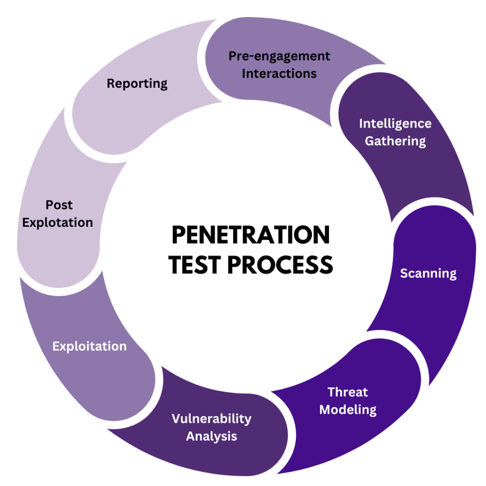
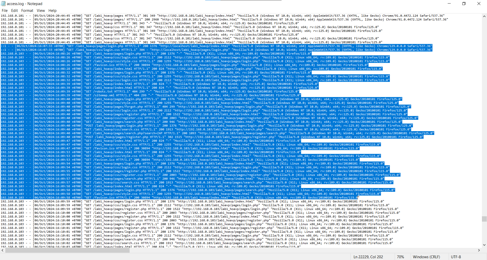

# OWASP ZAP INFO
- Overview: https://www.zaproxy.org/pdf/ZAPGettingStartedGuide-2.15.pdf

# PENETRATION TEST PROCESS
- Description: Penetration testing, also known as “pentesting”, is a valuable tool for identifying and addressing vulnerabilities in a system or network. When performed correctly, a penetration test can help ensure the security and integrity of sensitive data.
- Document: https://www.netguru.com/blog/penetration-testing-steps

# ZAP & PENTEST PROCESS
1. Equipment and tools are used for laboratory:
- 1 laptop running Windows 10 has a web application 
- 1 virtual machine running Kali linux with owasp zap
2. Script
- From the virtual machine (Kali linux), use the ZAP tool to scan the web application on Windows 10.
3. Steps proceed
- Copy link web app to URL box (URL to attack) and press attack

- After that, we got the results

4. Analysis and compared with pentest process
- Firstly, Zap took the second step in the Pentest process (Intelligence gathering): 
    + Zap collects links (URLs) related to the website's websites  by Spider's scanning mechanism (1)

- Secondly, Zap took the third step in Pentest (Scanning):
    + Using the operation mechanism of the active scan mode, Zap has issued a warning and judgment of potential vulnerabilities

- Finally, Zap supports Pentester to implement step 5, by making a description of the potential vulnerabilities that it scans

5. Evidences in log (access.log)
- find all the hyperlinks in the page (spider mechanism) 
- try SQL Injection

# ...