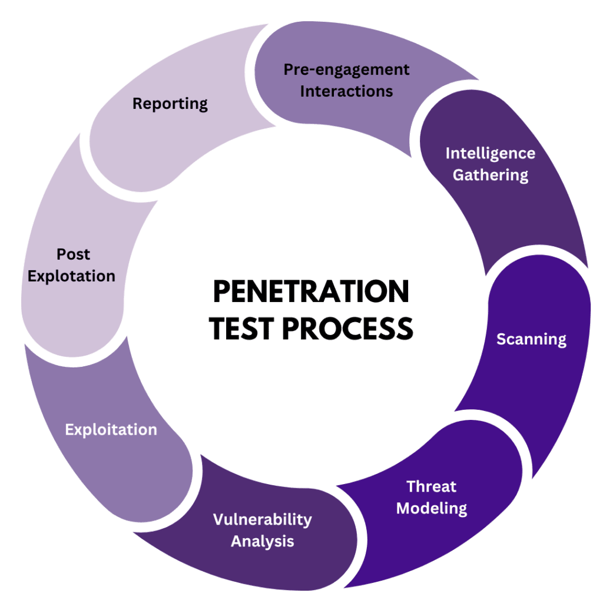

# THÔN TIN VỀ CÔNG CỤ OWASP ZAP (OWASP ZAP INFO)
- Tổng quan: https://www.zaproxy.org/pdf/ZAPGettingStartedGuide-2.15.pdf
<h1> </h1>

# QUY TRÌNH KIỂM THỬ (PENETRATION TEST PROCESS)
- Mô tả: Kiểm thử thâm nhập, còn được gọi là “kiểm thử thâm nhập”, là một công cụ có giá trị để xác định và giải quyết các lỗ hổng trong hệ thống hoặc mạng. Khi được thực hiện đúng cách, kiểm thử thâm nhập có thể giúp đảm bảo tính bảo mật và toàn vẹn của dữ liệu nhạy cảm.
- Tài liệu tham khảo: https://www.netguru.com/blog/penetration-testing-steps

| STEP | Pentest Step                     | Mô tả                                                                                                                                                                   |
|------|----------------------------------|------------------------------------------------------------------------------------------------------------------------------------------------------------------------|
| 1    | Pre-engagement Interactions      | Xác định phạm vi kiểm thử, mục tiêu, rủi ro pháp lý và ký thỏa thuận NDA. Thống nhất các phương pháp kiểm thử (black box, white box, gray box) giữa bên kiểm thử và bên khách hàng. |
| 2    | Intelligence Gathering           | Tìm kiếm thông tin liên quan đến hệ thống và tổ chức mục tiêu. Bao gồm các kỹ thuật thu thập thông tin công khai (OSINT) như quét tên miền, IP, DNS, và dịch vụ đang chạy.  |
| 3    | Scanning                         | Sử dụng các công cụ quét tự động như Nmap, Nessus, hoặc OpenVAS để quét các cổng mở, dịch vụ, hệ điều hành, và lỗ hổng bảo mật trên hệ thống.                        |
| 4    | Threat Modeling                  | Phân tích và lập bản đồ các điểm yếu đã phát hiện để mô hình hóa các mối đe dọa có thể xảy ra, xác định con đường tấn công tiềm tàng và tài sản quan trọng cần bảo vệ.    |
| 5    | Vulnerability Analysis           | Đánh giá và phân tích các lỗ hổng đã phát hiện, tìm hiểu các nguy cơ và tiềm năng khai thác của từng lỗ hổng, xếp hạng dựa trên mức độ nguy hiểm và khả năng khai thác.  |
| 6    | Exploitation                     | Thực hiện khai thác các lỗ hổng để truy cập vào hệ thống, bao gồm các tấn công như SQL Injection, Cross-Site Scripting (XSS), nhằm xâm nhập mà không ảnh hưởng đến hệ thống. |
| 7    | Post Exploitation                | Duy trì quyền truy cập sau khi khai thác thành công, thực hiện leo thang đặc quyền, di chuyển qua các phần khác của hệ thống, hoặc thu thập dữ liệu quan trọng.         |
| 8    | Reporting                        | Tổng hợp các kết quả kiểm thử, mô tả chi tiết các lỗ hổng đã phát hiện, cách khai thác, mức độ rủi ro và tác động tiềm tàng. Đưa ra các khuyến nghị khắc phục và bảo vệ hệ thống. |

<h1> </h1>

# Tính năng của ZAP 
| Tính năng                            | Mô tả                                                                                                                                                                   |
|------------------------------------|-------------------------------------------------------------------------------------------------------------------------------------------------------------------------------|
| Intercepting Proxy                 | ZAP hoạt động như một proxy giữa trình duyệt và ứng dụng web, cho phép bạn chặn và sửa đổi các yêu cầu và phản hồi HTTP/HTTPS trong thời gian thực.                        |
| Automated Scanner                  | ZAP có một trình quét tự động tích hợp, giúp bạn tìm các lỗ hổng phổ biến như SQL Injection, Cross-Site Scripting (XSS), CSRF, và nhiều lỗ hổng bảo mật khác.         |
| Spidering                          | ZAP có một tính năng spider để thu thập tất cả các URL và trang có trên một ứng dụng web, từ đó có thể tìm ra các lỗ hổng trên toàn bộ hệ thống.                       |
| Passive Scanning                   | Trong quá trình truyền tải dữ liệu, ZAP có thể thực hiện quét thụ động để phân tích yêu cầu và phản hồi HTTP mà không làm thay đổi hoặc ảnh hưởng đến hệ thống.       |
| Active Scanning                    | ZAP có thể thực hiện quét chủ động để cố gắng tìm các lỗ hổng bảo mật bằng cách gửi các "yêu cầu độc hại" và kiểm tra xem hệ thống có dễ bị tấn công không.           |
| Fuzzing                            | Tính năng Fuzzer của ZAP cho phép gửi hàng loạt dữ liệu ngẫu nhiên hoặc tùy chỉnh đến các tham số đầu vào để kiểm tra tính ổn định và bảo mật của hệ thống, giúp phát hiện lỗi bảo mật liên quan đến input validation. |
| Session Management                 | ZAP hỗ trợ quản lý các phiên làm việc của người dùng, giúp kiểm tra các vấn đề bảo mật liên quan đến quản lý session như session fixation hay session hijacking.      |
| User Management                    | Cho phép bạn định cấu hình các tài khoản người dùng khác nhau, giúp kiểm tra bảo mật dựa trên nhiều cấp độ quyền hạn khác nhau.                                       |
| Forced Browsing                    | Tính năng này giúp phát hiện các trang hoặc tài nguyên không công khai (không có trong sitemap hay không được liên kết trực tiếp) nhưng vẫn có thể truy cập được.    |
| Scriptable Scanning                | ZAP cho phép người dùng viết các script để tùy chỉnh quá trình kiểm tra bảo mật. Điều này có thể bao gồm việc thêm các kỹ thuật kiểm tra bảo mật riêng hoặc điều chỉnh cách quét. |
| Plug-n-Hack Integration            | ZAP hỗ trợ tích hợp với các trình duyệt thông qua Plug-n-Hack, giúp dễ dàng thiết lập và cấu hình môi trường kiểm thử.                                                  |
| Authentication Support             | ZAP có thể kiểm tra các cơ chế xác thực của ứng dụng, bao gồm việc kiểm tra các lỗ hổng như thiếu bảo vệ mật khẩu hoặc bỏ qua quá trình đăng nhập.                    |
| API Integration                    | ZAP có một API để tích hợp dễ dàng với các công cụ và hệ thống CI/CD (Continuous Integration/Continuous Deployment), giúp tự động hóa quy trình kiểm thử bảo mật.     |
| Alert System                       | ZAP tạo ra các cảnh báo khi phát hiện lỗ hổng bảo mật hoặc các vấn đề tiềm tàng và cho phép phân loại, xem chi tiết về từng cảnh báo.                                  |
| WebSocket Support                  | ZAP có thể giám sát và kiểm tra các kết nối WebSocket, cho phép kiểm thử các ứng dụng sử dụng giao thức này.                                                            |
| Docker Support                     | ZAP cung cấp phiên bản Docker để dễ dàng triển khai trong môi trường container, thuận tiện cho việc tích hợp vào quy trình phát triển phần mềm.                          |
| Command Line Interface - CLI       | ZAP có thể chạy từ dòng lệnh, cho phép thực hiện các tác vụ quét, fuzzing, hoặc báo cáo một cách tự động mà không cần giao diện người dùng.                           |
| Custom Payloads                    | Người dùng có thể tạo và tải lên các payload tùy chỉnh để kiểm tra các lỗ hổng bảo mật phức tạp hoặc chưa được bao gồm trong bộ kiểm tra mặc định.                    |
| Add-ons                            | ZAP có thể được mở rộng với các add-on từ ZAP Marketplace, giúp bổ sung thêm nhiều tính năng và khả năng quét bảo mật chuyên sâu hơn.                                   |
| Reporting                          | ZAP có thể tạo báo cáo chi tiết về các lỗ hổng phát hiện được, bao gồm báo cáo HTML, XML, hoặc JSON để phân tích hoặc chia sẻ với các bên liên quan.                  |
| Context Management                 | Tính năng này giúp kiểm tra bảo mật trong một ngữ cảnh nhất định, ví dụ như chỉ quét các phần cụ thể của ứng dụng hoặc kiểm tra theo quyền hạn của một nhóm người dùng nhất định. |
| Ajax Spider Support                | ZAP có thể xử lý các ứng dụng web hiện đại sử dụng JavaScript và AJAX để tải động dữ liệu, giúp phát hiện các lỗ hổng mà spider truyền thống có thể bỏ qua.         |

<h1> </h1>

# ZAP FEATURE & PENETRATION TEST PROCESS

| STEP | Pentest Step                     | ZAP Features                                                                                                                                              |
|------|----------------------------------|------------------------------------------------------------------------------------------------------------------------------------------------------------|
| 1    | Pre-engagement Interactions      | Không có tính năng ZAP hỗ trợ                                                                                                                             |
| 2    | Intelligence Gathering           | Spidering, Passive Scanning, WebSocket Support, Forced Browsing                                                                                            |
| 3    | Scanning                         | Automated Scanner, Active Scanning, Passive Scanning, Vulnerability Analysis                                                                               |
| 4    | Threat Modeling                  | Alert System, Context Management                                                                                                                          |
| 5    | Vulnerability Analysis           | Vulnerability Analysis, Fuzzer                                                                                                                             |
| 6    | Exploitation                     | Exploitation thông qua Proxy, Scripting                                                                                                                    |
| 7    | Post Exploitation                | Session Management, User Management                                                                                                                        |
| 8    | Reporting                        | Reporting, API Integration                                                                                                                                 |

###
<h1> </h1>

# CƠ CHẾ THỰC HIỆN CỦA CÁC TÍNH NĂNG 
| Tính năng                    | Cơ chế                                                                                       | Cách thực hiện                                                                                                                                                                                                                                                                              |
|-----------------------------|---------------------------------------------------------------------------------------------|---------------------------------------------------------------------------------------------------------------------------------------------------------------------------------------------------------------------------------------------------------------------------------------------|
| Spidering                   | Tự động thu thập thông tin bằng cách quét các liên kết trong ứng dụng web.                | Spider là một công cụ được sử dụng để tự động khám phá các tài nguyên mới (URL) trên một trang web cụ thể. Nó bắt đầu bằng một danh sách các URL cần truy cập (hạt giống). Khi Spider được khởi động, nó sẽ truy cập các URL này, xác định tất cả các siêu liên kết trong trang và thêm chúng vào danh sách các URL cần truy cập. Quá trình này tiếp tục theo cách đệ quy miễn là tìm thấy các tài nguyên mới. |
| Passive Scanning            | Quá trình quét thụ động mà không làm thay đổi trạng thái của ứng dụng.                    | ZAP theo dõi và phân tích tất cả các yêu cầu và phản hồi từ máy chủ trong khi người dùng tương tác với ứng dụng web. Điều này cho phép ZAP phát hiện các lỗ hổng bảo mật mà không gửi bất kỳ yêu cầu độc hại nào. Các cảnh báo được tạo ra trong tab "Alerts" khi quét thụ động hoàn tất.                                    |
| WebSocket Support           | Hỗ trợ kiểm thử bảo mật cho giao thức WebSocket.                                          | ZAP có thể quét và phân tích các kết nối WebSocket bằng cách sử dụng proxy tích hợp. Khi một kết nối WebSocket được thiết lập, ZAP có thể theo dõi và phân tích các tin nhắn được gửi và nhận, từ đó xác định các lỗ hổng bảo mật trong giao thức này.                                          |
| Forced Browsing             | Tìm kiếm các tài nguyên bị ẩn hoặc không dễ dàng tiếp cận.                                 | ZAP thử nghiệm truy cập các URL mà người dùng có thể không tìm thấy thông qua giao diện người dùng thông thường. Tính năng này cho phép ZAP xác định các đường dẫn ẩn và kiểm tra xem liệu có thể truy cập chúng mà không cần sự cho phép hay không. Điều này giúp phát hiện các lỗ hổng bảo mật liên quan đến quyền truy cập.                 |
| Automated Scanner           | Tự động quét để phát hiện các lỗ hổng bảo mật.                                          | Người dùng có thể khởi động quá trình quét tự động bằng cách chọn một mục tiêu và nhấn nút "Start Scan". ZAP sẽ kiểm tra các lỗ hổng bảo mật phổ biến trong ứng dụng, như SQL Injection, XSS, và CSRF, bằng cách gửi các yêu cầu đến ứng dụng và phân tích phản hồi.                                            |
| Active Scanning             | Gửi yêu cầu có chủ đích để tìm kiếm các lỗ hổng.                                         | Sau khi phát hiện các lỗ hổng tiềm năng trong quá trình quét tự động, người dùng có thể thực hiện quét chủ động bằng cách chọn các điểm yếu cụ thể và yêu cầu ZAP gửi các yêu cầu đã điều chỉnh để kiểm tra khả năng bảo mật của ứng dụng, như tấn công SQL Injection hoặc XSS. .                                     |
| Vulnerability Analysis       | Phân tích các lỗ hổng đã phát hiện để xác định mức độ nghiêm trọng và cung cấp hướng dẫn. | Sau khi quét, ZAP sẽ liệt kê tất cả các lỗ hổng trong tab "Alerts" với thông tin chi tiết về mức độ nghiêm trọng, cách khai thác và hướng dẫn khắc phục. Người dùng có thể phân loại các lỗ hổng này và lên kế hoạch khắc phục.                                                            |
| Fuzzer                      | Gửi dữ liệu không hợp lệ để kiểm tra cách xử lý của ứng dụng.                             | ZAP cho phép người dùng sử dụng tính năng Fuzzer để gửi các chuỗi dữ liệu ngẫu nhiên vào các điểm nhập dữ liệu của ứng dụng (như các trường form). Điều này giúp xác định xem ứng dụng có xử lý đúng các dữ liệu không hợp lệ hay không và tìm ra các lỗ hổng liên quan đến input validation.            |
| Alert System                | Hệ thống cảnh báo thông báo cho người dùng về các lỗ hổng đã phát hiện.                  | Sau khi quá trình quét hoàn tất, ZAP sẽ tự động hiển thị tất cả các cảnh báo liên quan đến bảo mật trong tab "Alerts". Người dùng có thể xem chi tiết về từng cảnh báo, bao gồm mô tả và hướng dẫn khắc phục. .                                                           |
| Context Management          | Quản lý thông tin ngữ cảnh để tổ chức và theo dõi các yếu tố kiểm thử khác nhau.         | ZAP cho phép người dùng tạo và quản lý các ngữ cảnh khác nhau, giúp phân loại các URL, trình duyệt và người dùng để tổ chức quy trình kiểm thử. Việc quản lý ngữ cảnh giúp tăng tính linh hoạt và hiệu quả của quá trình kiểm thử.                                                    |
| Exploitation thông qua Proxy| Khai thác lỗ hổng thông qua proxy để xem hành vi của ứng dụng trong tình huống cụ thể.   | Người dùng có thể sử dụng proxy của ZAP để chặn và chỉnh sửa các yêu cầu trước khi gửi đến máy chủ. Điều này cho phép họ khai thác các lỗ hổng đã phát hiện và xem cách ứng dụng phản hồi trong các tình huống cụ thể.                                                            |
| Scripting                   | Hỗ trợ viết script để mở rộng khả năng của ZAP.                                          | Người dùng có thể viết và chạy các script để tự động hóa các tác vụ kiểm thử bảo mật, như tự động hóa quá trình quét hoặc kiểm tra. ZAP hỗ trợ nhiều ngôn ngữ lập trình khác nhau cho việc viết script.                                                                |
| Session Management          | Quản lý các phiên làm việc của người dùng để bảo vệ chống lại các cuộc tấn công.        | ZAP theo dõi và phân tích thông tin phiên làm việc để đảm bảo rằng các lỗ hổng bảo mật liên quan đến session (như session fixation hoặc session hijacking) không thể bị khai thác.                                                                                      |
| User Management             | Quản lý thông tin người dùng và quyền truy cập.                                          | ZAP cung cấp chức năng quản lý tài khoản người dùng để kiểm soát quyền truy cập vào các tính năng khác nhau trong ZAP. Người dùng có thể tạo, sửa đổi hoặc xóa tài khoản và phân quyền cho từng tài khoản.                                                         |
| Reporting                   | Tạo báo cáo tự động về các lỗ hổng bảo mật và phát hiện.                                 | Sau khi hoàn tất kiểm thử, ZAP có khả năng xuất báo cáo dưới nhiều định dạng khác nhau (HTML, XML, JSON), bao gồm thông tin chi tiết về các lỗ hổng đã phát hiện, mức độ nghiêm trọng và các hướng dẫn khắc phục.                                                            |
| API Integration             | Tích hợp API cho phép tự động hóa quy trình kiểm thử bảo mật.                             | Sử dụng API của ZAP để tương tác với các công cụ CI/CD, tự động hóa quá trình quét và tạo báo cáo. Điều này giúp tích hợp ZAP vào quy trình phát triển và kiểm thử phần mềm một cách dễ dàng.                                                                                      |

