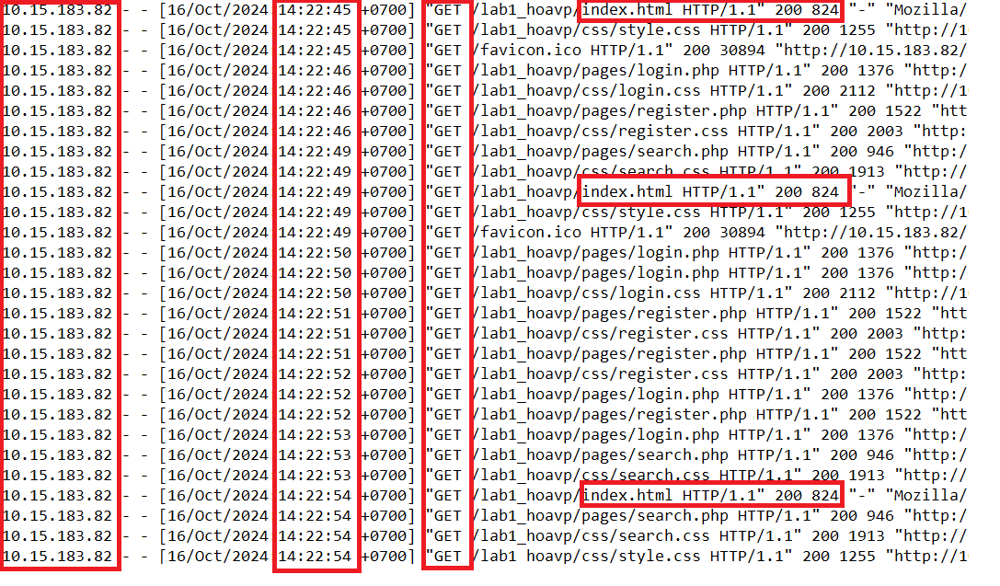

# SO SÁNH GIỮA SPIDER VÀ FORCED BROWSING

## SPIDER
1. Cơ chế
- Spider là một công cụ được sử dụng để tự động khám phá các tài nguyên mới (URL) trên một trang web cụ thể. Nó bắt đầu bằng một danh sách các URL cần truy cập (hạt giống). Khi Spider được khởi động, nó sẽ truy cập các URL này, xác định tất cả các siêu liên kết trong trang và thêm chúng vào danh sách các URL cần truy cập. Quá trình này tiếp tục theo cách đệ quy miễn là tìm thấy các tài nguyên mới.
2. Code 
```python
import requests
from bs4 import BeautifulSoup
from urllib.parse import urljoin

# URL mục tiêu (thay đổi URL này theo trang bạn muốn thu thập)
start_url = 'http://example.com'

# Bộ nhớ lưu các URL đã truy cập để tránh truy cập lại
visited_urls = set()

def simple_spider(url):
    """Hàm thu thập tất cả các liên kết từ một URL"""
    # Kiểm tra nếu URL đã được thu thập
    if url in visited_urls:
        return

    print(f'Crawling: {url}')
    visited_urls.add(url)  # Đánh dấu URL đã truy cập

    try:
        # Gửi yêu cầu GET tới trang và lấy HTML
        response = requests.get(url)
        if response.status_code != 200:
            return
        
        # Sử dụng BeautifulSoup để phân tích HTML
        soup = BeautifulSoup(response.text, 'html.parser')

        # Tìm tất cả các thẻ 'a' chứa liên kết
        for link in soup.find_all('a', href=True):
            href = link['href']
            # Chuyển URL tương đối thành tuyệt đối
            full_url = urljoin(url, href)

            # Chỉ thu thập các URL có cùng domain
            if full_url.startswith(start_url):
                simple_spider(full_url)  # Gọi đệ quy để tiếp tục thu thập từ liên kết mới
    except requests.RequestException as e:
        print(f'Error crawling {url}: {e}')

# Bắt đầu thu thập từ URL mục tiêu
simple_spider(start_url)

# Hiển thị tất cả các URL đã thu thập
print('\n[+] URLs crawled:')
for visited_url in visited_urls:
    print(visited_url)

```
3. Log

    + IP: cùng địa chỉ IP
    + Thời gian: từ 14:22:45 đến 14:22:54 (9s)
    + Số lượng request: 28
    + Method HTTP: GET
    + URI: chủ yếu xoay quanh các trang liên kết cơ bản với index.html 
    + Mã phản hồi: 200

## FORCED BROWSING
1. Cơ chế
- Forced Browsing là một kỹ thuật tấn công mà kẻ tấn công cố gắng truy cập các tài nguyên trên một ứng dụng web mà không được phép. Kỹ thuật này thường được sử dụng để phát hiện các trang hoặc file không được liên kết từ giao diện người dùng nhưng có thể tồn tại trên máy chủ.
2. Code
```python 
import requests

# URL mục tiêu (thay đổi theo trang web bạn muốn thử)
target_url = 'http://example.com'

# Danh sách từ điển các đường dẫn bạn muốn thử
# Bạn có thể mở rộng danh sách này theo cách thủ công hoặc sử dụng một tệp wordlist
wordlist = [
    'admin/',
    'login/',
    'config.php',
    'backup/',
    'test/',
    'index.php.bak',
    'robots.txt',
    'hidden/',
    'uploads/',
    'wp-admin/',
    'wp-content/',
]

# Thêm các trạng thái đã thử vào đây
valid_urls = []

# Duyệt qua từng đường dẫn trong danh sách
for path in wordlist:
    url = target_url + '/' + path
    print(f'Trying: {url}')
    
    try:
        # Gửi yêu cầu GET tới đường dẫn
        response = requests.get(url)
        
        # Kiểm tra trạng thái phản hồi
        if response.status_code == 200:
            print(f'[+] Valid URL found: {url}')
            valid_urls.append(url)
        elif response.status_code == 403:
            print(f'[!] Forbidden (403): {url}')
        elif response.status_code == 404:
            print(f'[-] Not Found (404): {url}')
        else:
            print(f'[*] Status {response.status_code}: {url}')
    
    except requests.RequestException as e:
        print(f'[!] Error occurred: {e}')

# Hiển thị các URL hợp lệ đã tìm thấy
print('\n[+] Valid URLs discovered:')
for valid_url in valid_urls:
    print(valid_url)
```
3. Log
    + IP: cùng 1 địa chỉ IP
    + Thời gian phân tích: 1s (14:34:54)
    
    + Số lượng request: 28
    + Method HTTP: GET ( POST xuất hiện ở trang đặng nhập login.php và đăng ký register.php)
    
    
    + Tài nguyên truy cập: yêu cầu truy cập tới các tài nguyên lạ
    
    + Mã trạng thái phản hồi: Chủ yếu là 404
    

## BẢNG SO SÁNH

| **Tiêu chí nhận biết**          | **Spider**                                                 | **Forced Browsing**                                         |
|----------------------------------|------------------------------------------------------------|-------------------------------------------------------------|
| **Loại URL**                    | URL hợp lệ, có trong nội dung trang web (HTML, CSS, hình ảnh). | URL nhạy cảm, không công khai, như `/admin`, `/config.php`.  |
| **Số lượng yêu cầu**             | Nhiều, do thu thập tất cả liên kết và tài nguyên.          | ít hơn vì chỉ kiểm tra các URL từ wordlist.                   |
| **Mã trạng thái HTTP phổ biến**  | **200 OK** cho hầu hết các yêu cầu hợp lệ.                 | **404 Not Found**, **403 Forbidden** thường xuất hiện nhiều. |
| **Tốc độ yêu cầu**               | Gửi nhiều yêu cầu liên tục trong thời gian ngắn.           | Rất nhiều request trong 1s
| **Loại tài nguyên**              | Yêu cầu tới trang HTML, tài nguyên tĩnh (CSS, JS, hình ảnh). | Yêu cầu tới các file cấu hình, thư mục nhạy cảm.             |
|  |  |  |
| **Mục tiêu quét**                | Khám phá toàn bộ cấu trúc và liên kết website.             | Tìm kiếm các URL ẩn hoặc nhạy cảm.                           |
| **Thời gian phản hồi**           | Có thể dài hơn, do thu thập và xử lý nhiều tài nguyên.     | Ngắn hơn, chỉ kiểm tra một số URL nhất định.                 |
| **Phân bố mã trạng thái HTTP**   | Chủ yếu là **200 OK**, có thể có một số **301 Redirect**.  | Chủ yếu là **403**, **404**, đôi khi **200 OK** nếu tìm thấy URL hợp lệ. |


